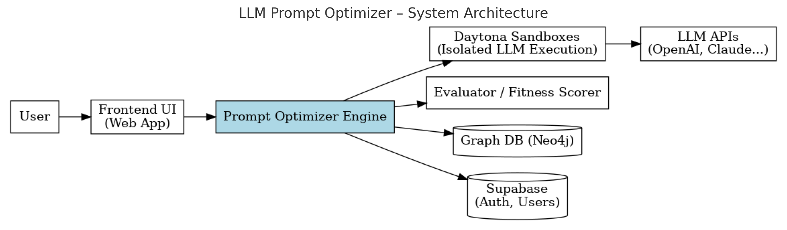

# LLM Prompt Optimizer - Project Specification

## Overview

The goal of the project is to **build a system that optimizes prompts using evolutionary algorithms**, leveraging a combination of a graph database to track prompt relationships, a key-value store to manage generations, and Supabase for user accounts and permission control.

Daytona sandboxes are used to safely and efficiently execute prompt variations in parallel across different LLMs. Workspace snapshots preserve successful prompt lineages and allow for branching experimentation.

---

## Key Objectives

- Evolve and optimize prompts automatically using evolutionary strategies.
- Track relationships and modifications between prompts in a **graph database**.
- Manage user accounts, permissions, and data access via **Supabase**.
- Execute prompt evaluations in **Daytona sandboxes**, ensuring safe and reproducible testing environments.

---

## System Architecture

### 1. **Evolutionary Prompt Engine**
- **Mutation Functions**: Random word insertion/removal, synonym replacement, structure shifts.
- **Fitness Functions**: Model response metrics (accuracy, relevance, toxicity, coherence).
- **Selection Mechanism**: Tournament selection or roulette wheel.
- **Generational Flow**: Prompts evolve over multiple generations, with top performers advancing.

### 2. **Graph Database (e.g., Neo4j)**
- Nodes: Prompts
- Relationships: "Mutated from", "Derived from", "Branch of"
- Enables lineage tracking, branching, and comparison of prompt families.

### 3. **User Management via Supabase**
- Authentication & Authorization
- Role-based access control (Admin, User, Viewer)
- User-linked prompt experiments and saved workspaces

### 4. **Execution via Daytona Sandboxes**
- Each prompt variation runs in an isolated sandbox.
- Parallel execution with model endpoints (e.g., OpenAI, Anthropic, local LLMs).
- Sandboxes provide consistent runtime environments.

---

## Technology Stack

| Component           | Technology          |
|---------------------|---------------------|
| Frontend            | React + Tailwind    |
| Backend             | Node.js / Python    |
| Graph DB            | Neo4j               |
| User Management     | Supabase            |
| Execution Env       | Daytona Sandboxes   |
| Model APIs          | OpenAI, Claude, Llama, etc. |

---

## System Architecture

